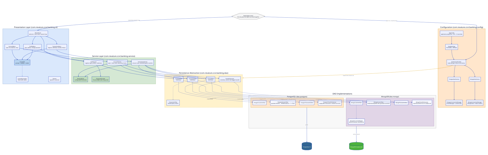
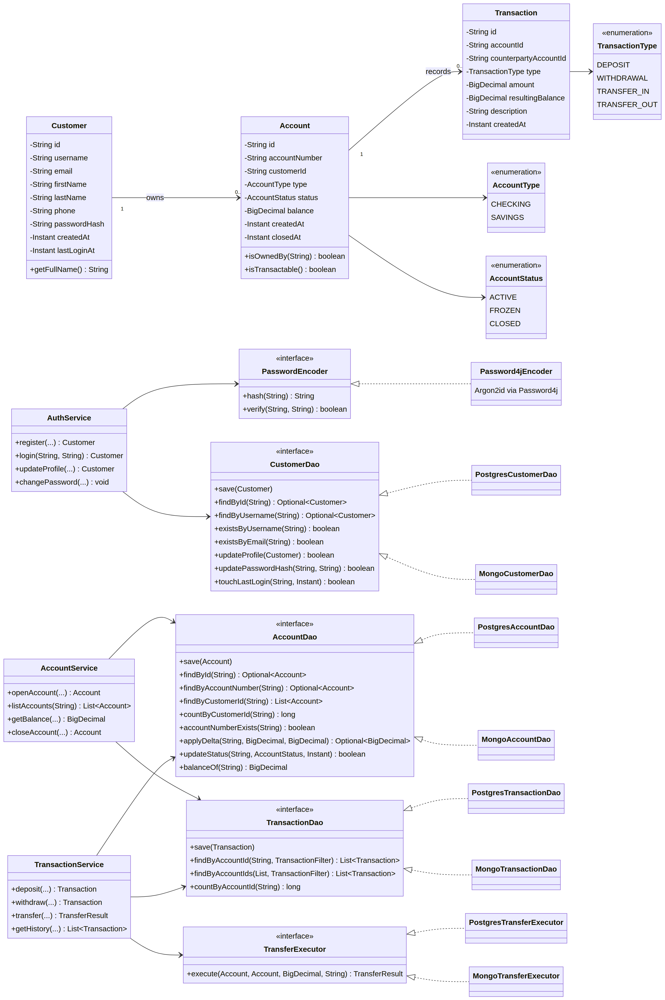
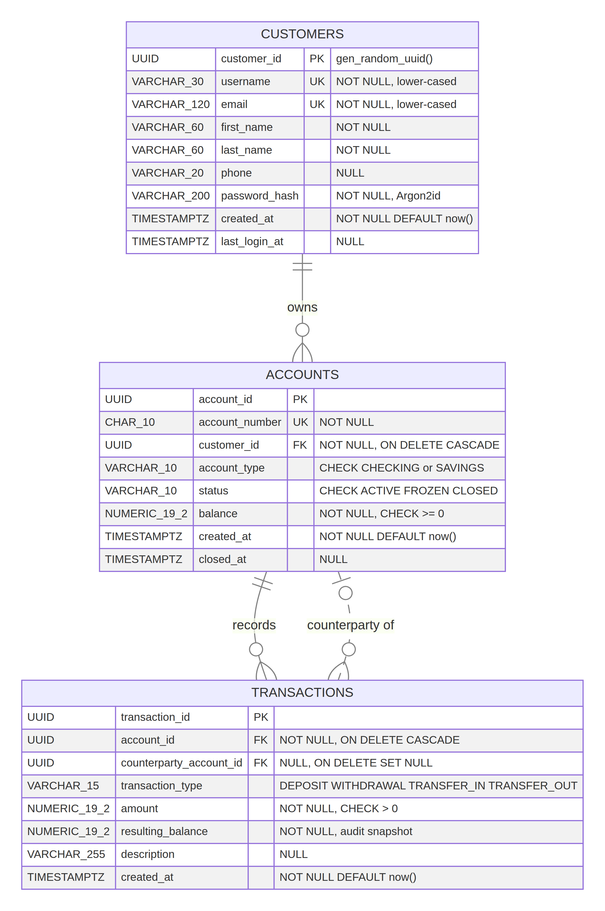
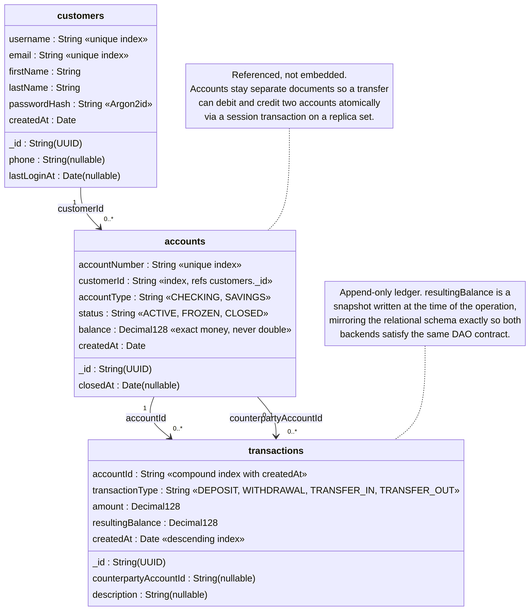
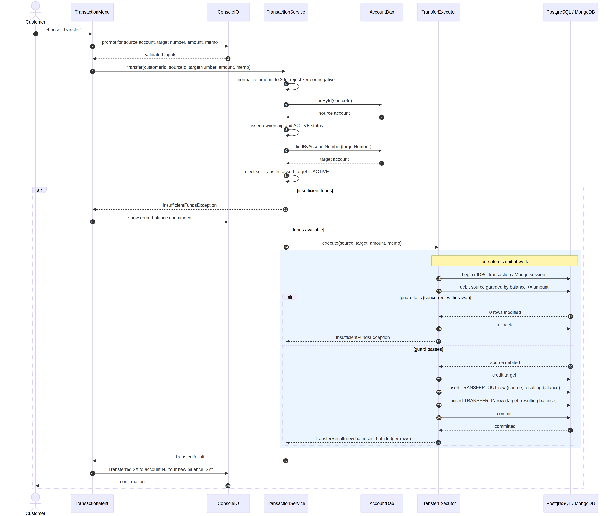

# P1_BankingApp — Console Banking Application

A console-based retail banking application written in Java 21. Customers register, open checking and
savings accounts, deposit and withdraw funds, transfer money to their own or another customer's
accounts, and review a filterable transaction ledger. The application persists data to **either
PostgreSQL or MongoDB**, selected by a single configuration value, without any change to the console
menus, the service layer, or the banking rules.

The project is deliberately organised so that the persistence technology is the *only* thing that
varies. Both backends implement the same DAO interfaces and are verified by the same shared contract
test suite, which is the strongest available evidence that swapping databases does not change
application behaviour.

---

## Table of Contents

1. [Purpose](#purpose)
2. [Features](#features)
3. [Technologies](#technologies)
4. [Architecture](#architecture)
5. [Domain Model](#domain-model)
6. [Database Designs](#database-designs)
7. [DAO Implementation](#dao-implementation)
8. [Database Selection Process](#database-selection-process)
9. [Configuration](#configuration)
10. [Setup and Run](#setup-and-run)
11. [Testing](#testing)
12. [Security Notes](#security-notes)
13. [Project Layout](#project-layout)
14. [User Story Traceability](#user-story-traceability)
15. [Known Limitations](#known-limitations)
16. [Optional Enhancements Completed](#optional-enhancements-completed)

---

## Purpose

The application models the core of a retail bank from the customer's point of view. It exists to
demonstrate a cleanly layered Java backend in which business rules are expressed once, in the service
layer, and remain correct regardless of whether the data lives in a relational database or a document
store. Every rule that protects a customer's money — ownership checks, account status checks,
overdraft prevention, and transfer atomicity — is enforced in code that has no knowledge of SQL or
BSON.

## Features

Customers interact with the system entirely through a console interface. After registering with a
username, email, and password, they log in and reach a main menu that leads to account management,
transactions, profile maintenance, and a dashboard summary.

| Area | Capabilities |
|---|---|
| **Registration and authentication** | Self-service registration with duplicate username and email rejection; login by username and password; a generic failure message that does not disclose which field was wrong |
| **Profile** | View profile; update email, name, and phone individually (blank input keeps the current value); change password after re-authenticating with the current one |
| **Accounts** | Open checking or savings accounts with an optional opening deposit; list all accounts with balances and status; view a single account balance; close an account once it is emptied |
| **Deposits and withdrawals** | Deposit and withdraw to the cent with two-decimal precision; every debit is checked against the available balance and, for savings, against the configured minimum balance |
| **Transfers** | Transfer between a customer's own accounts or to any other customer's account by account number; both legs commit or neither does |
| **Transaction history** | Per-account and combined cross-account history; filter by transaction type and by date range; each row shows date, type, amount, resulting balance, and description |
| **Reliability** | Invalid input, missing records, duplicate data, unauthorised access, insufficient funds, and database errors are all reported as readable messages; the application never terminates on a handled error |

Money is represented as `BigDecimal` throughout and stored as `NUMERIC(19,2)` in PostgreSQL and
`Decimal128` in MongoDB. Floating-point types are never used for currency.

## Technologies

| Concern | Choice |
|---|---|
| Language and build | Java 21, Maven |
| Relational persistence | PostgreSQL 18.4 via JDBC (`org.postgresql:postgresql`) with prepared statements throughout |
| Document persistence | MongoDB 8.2.12 via the synchronous MongoDB Java driver (`mongodb-driver-sync`) |
| Password hashing | [Password4j](https://password4j.com/) configured for **Argon2id** |
| Testing | JUnit 6 (Jupiter), JaCoCo for line and branch coverage |
| Diagrams | ERD, Class, Sequence, Architecture |
| Version control | Git |

## Architecture

The application follows a strict five-layer structure in which dependencies point in one direction
only. The presentation layer knows about services; services know about DAO interfaces; only the DAO
implementations know about JDBC or the MongoDB driver.



| Layer | Package | Responsibility |
|---|---|---|
| **Presentation** | `banking.ui` | Menus, prompts, input validation, table rendering, session state. Contains no business rules and never touches a database. `ConsoleIO` is an injectable boundary, which is what makes the console testable. |
| **Service** | `banking.service` | All banking rules: registration and authentication, account opening and closure eligibility, ownership and status enforcement, amount validation, overdraft prevention, transfer orchestration, history retrieval. |
| **Data access** | `banking.dao` | Technology-neutral interfaces (`CustomerDao`, `AccountDao`, `TransactionDao`, `TransferExecutor`) plus the shared `TransactionFilter` criteria object. |
| **DAO implementations** | `banking.dao.postgres`, `banking.dao.mongo` | Two complete implementations of every interface, each handling its own error translation and resource management. |
| **Model** | `banking.model` | `Customer`, `Account`, `Transaction` and the `AccountType`, `AccountStatus`, `TransactionType` enums, all with encapsulated state. |
| **Configuration** | `banking.config` | `AppConfig` loads externalised settings; `DaoFactoryProvider` reads `db.type` and returns the matching factory; connection managers own connection lifecycle and schema initialisation. |

`BankingApp.main` is the only composition root. It resolves configuration, obtains a `DaoFactory`,
wires the services, and hands control to `MenuRouter`. Because that is the single place where
concrete implementations are named, changing databases touches exactly one configuration value.

An editable version of this diagram is available at
[`docs/diagrams/architecture.drawio`](docs/diagrams/architecture.drawio).

## Domain Model



A customer owns zero or more accounts, and each account owns an append-only list of transactions. A
transfer is represented as two ledger rows — a `TRANSFER_OUT` on the source account and a
`TRANSFER_IN` on the destination — linked by `counterpartyAccountId`. Every transaction stores the
balance that resulted from it, so a statement can be reconstructed without replaying arithmetic.

## Database Designs

### PostgreSQL (relational)

Three normalised tables with foreign keys, check constraints, and supporting indexes. The schema is
created automatically on first run when `app.schema.autoInitialize=true`.



The editable source is [`docs/diagrams/erd.drawio`](docs/diagrams/erd.drawio).

| Table | Key columns | Notable constraints |
|---|---|---|
| `customers` | `customer_id` UUID PK | `username` and `email` are each `UNIQUE`; `password_hash` holds an Argon2id digest and never a plaintext value |
| `accounts` | `account_id` UUID PK, `customer_id` FK | `account_number` is `UNIQUE`; `account_type` and `status` are constrained to their enum values; `CHECK (balance >= 0)` is a database-level backstop against overdrafts |
| `transactions` | `transaction_id` UUID PK, `account_id` FK, `counterparty_account_id` FK | `CHECK (amount > 0)`; `resulting_balance` is an immutable audit snapshot; `ON DELETE CASCADE` from accounts, `ON DELETE SET NULL` for the counterparty |

Indexes exist on `accounts(customer_id)`, `transactions(account_id, created_at DESC)` to serve the
newest-first history query, and `transactions(transaction_type)` for type filtering.

### MongoDB (document)

Three collections that mirror the relational design using **references rather than embedding**.



Embedding accounts inside customers was considered and rejected. A transfer must debit one account
and credit another atomically, and those two accounts frequently belong to *different* customers.
Keeping accounts as independent documents allows a single multi-document transaction to cover both
legs. Embedding would have made cross-customer transfers either non-atomic or dependent on rewriting
two large customer documents.

Money is stored as `Decimal128` so that decimal arithmetic is exact. Unique indexes are created on
`customers.username`, `customers.email`, and `accounts.accountNumber`; secondary indexes mirror the
relational ones.

## DAO Implementation

Both implementations satisfy the same four interfaces. The interesting differences are in how each
technology enforces the invariants.

| Operation | PostgreSQL | MongoDB |
|---|---|---|
| Balance change | `UPDATE accounts SET balance = balance + ? WHERE account_id = ? AND balance + ? >= ?` — the guard is part of the statement, so a concurrent debit cannot slip through | `findOneAndUpdate` with a filter that includes the minimum-balance guard and an atomic increment, returning the post-image |
| Transfer | One JDBC transaction with `autoCommit` disabled; rows are locked in a deterministic order to avoid deadlocks; rollback on any failure | A driver session transaction with majority read and write concern; requires a replica set |
| Money mapping | `NUMERIC(19,2)` ⇄ `BigDecimal` | `Decimal128` ⇄ `BigDecimal` via `MongoDocumentMapper` |
| Error translation | SQLState inspection (for example unique-violation `23505`) raised as `DuplicateResourceException` | Duplicate key error code `11000` raised as the same application exception |
| Resource management | Try-with-resources on every `Connection`, `PreparedStatement`, and `ResultSet` | A single shared `MongoClient` closed by the factory |

Because both raise the same application-level exceptions, the service layer contains no
database-specific branching.

### Transfer atomicity

Transfer is the most safety-critical operation, so it is isolated behind its own `TransferExecutor`
interface rather than being assembled from individual DAO calls.



The service validates ownership, status, and available funds, then delegates the whole debit, credit,
and double ledger write to the executor as one atomic unit. If the guarded debit modifies zero rows —
which happens when a concurrent withdrawal drains the account after the balance check — the executor
rolls back and reports insufficient funds rather than producing a partial transfer.

## Database Selection Process

Selection is driven by one property:

```properties
db.type=postgres    # or: mongo
```

`AppConfig` resolves the value, `DatabaseType` parses it (accepting `postgres`, `postgresql`, `mongo`,
and `mongodb`), and `DaoFactoryProvider` returns either a `PostgresDaoFactory` or a
`MongoDaoFactory`. An unrecognised value fails fast at startup rather than silently defaulting.

Because the factory hands the services a set of interfaces, switching backends requires **no code
change whatsoever**:

```bash
# Run against PostgreSQL
mvn -q exec:java -Dexec.mainClass=com.revature.ccvi.banking.BankingApp -Ddb.type=postgres

# Run the identical build against MongoDB
mvn -q exec:java -Dexec.mainClass=com.revature.ccvi.banking.BankingApp -Ddb.type=mongo
```

## Configuration

All settings live in [`src/main/resources/application.properties`](src/main/resources/application.properties).
Every property may be overridden without editing the file, using precedence
**environment variable → `-D` system property → properties file**. An environment variable name is
the property name upper-cased with dots replaced by underscores, so `db.postgres.password` is
overridden by `DB_POSTGRES_PASSWORD`.

| Property | Default | Meaning |
|---|---|---|
| `db.type` | `postgres` | Which backend to use: `postgres` or `mongo` |
| `db.postgres.url` | `jdbc:postgresql://127.0.0.1:5432/bankingdb` | JDBC URL |
| `db.postgres.username` / `db.postgres.password` | `bankapp` / `bankapp_pw` | Development credentials; override in any real environment |
| `db.mongo.uri` | `mongodb://127.0.0.1:27017/?replicaSet=rs0` | Connection string; a replica set is required for transactional transfers |
| `db.mongo.database` | `bankingdb` | Database name |
| `bank.savings.minimumBalance` | `25.00` | Balance a savings account must retain after any debit |
| `bank.account.minimumOpeningDeposit` | `0.00` | Deposit required to open an account |
| `bank.account.maxPerCustomer` | `5` | Maximum simultaneously open accounts per customer |
| `bank.history.defaultPageSize` | `25` | Default history rows displayed |
| `security.argon2.memoryKib` | `15360` | Argon2id memory cost (15 MiB) |
| `security.argon2.iterations` | `3` | Argon2id time cost |
| `security.argon2.parallelism` | `1` | Argon2id lanes |
| `app.schema.autoInitialize` | `true` | Create tables, collections, and indexes on startup |
| `app.name` | `CCVI Community Bank` | Name shown in the console banner |

The committed credentials are throwaway local development values, present so that a reviewer can
clone and run the project immediately. Production credentials belong in environment variables; see
[Security Notes](#security-notes).

## Setup and Run

### Prerequisites

Java 21 and Maven are required. At least one of PostgreSQL or MongoDB must be reachable, depending on
the configured `db.type`.

### PostgreSQL

```bash
sudo apt-get install -y postgresql
sudo service postgresql start
sudo -u postgres psql -c "CREATE ROLE bankapp WITH LOGIN PASSWORD 'bankapp_pw';"
sudo -u postgres psql -c "CREATE DATABASE bankingdb OWNER bankapp;"
```

Tables and indexes are created automatically on first run.

### MongoDB

Transfers use multi-document transactions, which MongoDB only supports on a replica set. A
single-node replica set is sufficient for local use:

```bash
mongod --dbpath /data/db --replSet rs0 --bind_ip 127.0.0.1 --fork --logpath /var/log/mongodb/mongod.log
mongosh --quiet --eval 'rs.initiate({_id:"rs0",members:[{_id:0,host:"127.0.0.1:27017"}]})'
```

If the deployment is standalone rather than a replica set, `MongoTransferExecutor` detects the
missing transaction support and falls back to a guarded sequential debit-then-credit with
compensation on failure. That fallback is a convenience for local experimentation and is not
recommended for production.

### Build and run

```bash
mvn clean package                 # compile, run all tests, produce the jar
java -jar target/P1_BankingApp-1.0-SNAPSHOT.jar
```

Or select a backend explicitly at launch:

```bash
java -Ddb.type=mongo -jar target/P1_BankingApp-1.0-SNAPSHOT.jar
```

## Testing

The suite contains **326 automated tests** and all of them pass. Coverage is measured by JaCoCo and
enforced by a build rule, so `mvn verify` fails if coverage regresses below the configured floor.

| Metric | Result |
|---|---|
| Tests | 326 passing, 0 failures, 0 skipped |
| Line coverage | **88.1%** (1740 of 1975) |
| Branch coverage | **83.2%** (536 of 644) |

Coverage by package, with the layers that carry business risk deliberately highest:

| Package | Line | Branch |
|---|---|---|
| `service` | 96.5% | 92.6% |
| `model` | 100% | 97.6% |
| `util` | 100% | 100% |
| `dao` (interfaces, filter) | 100% | 100% |
| `ui` | 92.4% | 78.3% |
| `config` | 90.5% | 79.1% |
| `dao.postgres` | 85.3% | 77.3% |
| `dao.mongo` | 77.1% | 72.3% |

### How the suite is organised

The service layer is tested **without any database**. In-memory fake DAOs implement the same
interfaces as the real ones, so `AuthServiceTest`, `AccountServiceTest`, and `TransactionServiceTest`
exercise the banking rules directly and run in milliseconds.

The two DAO implementations share a single abstract contract test, `AbstractDaoContractTest`.
`PostgresDaoIT` and `MongoDaoIT` each extend it, so **the same 27 assertions run against both
backends**. This is the direct evidence for US-21: if either implementation diverges in behaviour,
the shared suite fails. Both integration classes skip automatically, rather than failing, when their
database is not reachable.

The console is tested end to end by piping scripted transcripts through `ConsoleIO` and asserting on
the captured output, covering complete journeys such as register → log in → open account → deposit →
transfer → filter history → close account → log out, along with the error paths.

```bash
mvn test                                   # unit and integration tests
mvn verify                                 # adds the JaCoCo report and coverage gate
mvn test -Dtest=TransactionServiceTest     # a single class
open target/site/jacoco/index.html         # the HTML coverage report
```

### A defect the tests uncovered

The scripted console tests surfaced a real bug rather than merely confirming existing behaviour. When
standard input was exhausted, `ConsoleIO.readMenuChoice` threw a generic `ValidationException`; every
menu loop caught it, printed the message, and looped again — but the reader kept returning
end-of-stream forever, so the application spun printing the same error until the heap was exhausted.
Running the app with piped input or `< /dev/null` would have pegged a CPU core indefinitely. The fix
introduces a dedicated `EndOfInputException` so that menu loops can distinguish "bad input,
re-prompt" from "stream closed, shut down cleanly", and a regression test now pins the behaviour.

## Security Notes

Passwords are hashed with **Argon2id** through Password4j, the algorithm recommended by OWASP for
password storage. Each hash carries its own random salt and encodes its own parameters, so cost
factors can be raised later without invalidating existing hashes. Plaintext passwords are never
stored, logged, or included in any console output, and `Customer.toString()` deliberately omits the
hash. Login failures return one generic message so an attacker cannot enumerate valid usernames.

All PostgreSQL access uses `PreparedStatement` with bound parameters, so string concatenation never
reaches SQL. MongoDB queries are built with the driver's `Filters` builders rather than string
interpolation.

Regarding credentials in the repository: the values in `application.properties` are local
development throwaways, included so the project runs immediately after cloning, and the file
documents that real secrets belong in environment variables. For a production deployment, supply
`DB_POSTGRES_PASSWORD`, `DB_MONGO_URI`, and related variables through the environment or a secrets
manager, and consider removing the development defaults entirely.

## Project Layout

```
P1_BankingApp/
├── pom.xml
├── README.md
├── docs/
│   └── diagrams/
│       ├── erd.drawio            editable ERD (draw.io)
│       ├── erd.png
│       ├── architecture.drawio   editable architecture diagram (draw.io)
│       ├── architecture.d2 / .svg / .png
│       ├── class-diagram.mmd / .png
│       ├── mongo-collections.mmd / .png
│       └── sequence-transfer.mmd / .png
└── src/
    ├── main/
    │   ├── java/com/revature/ccvi/banking/
    │   │   ├── BankingApp.java            composition root
    │   │   ├── config/                    AppConfig, DatabaseType, factories, connection managers
    │   │   ├── dao/                       DAO interfaces, TransactionFilter, TransferExecutor
    │   │   │   ├── postgres/              JDBC implementations
    │   │   │   └── mongo/                 MongoDB implementations + document mapper
    │   │   ├── exception/                 domain exception hierarchy
    │   │   ├── model/                     Customer, Account, Transaction, enums
    │   │   ├── service/                   AuthService, AccountService, TransactionService, rules, hashing
    │   │   ├── ui/                        MenuRouter, menus, ConsoleIO, formatter, session
    │   │   └── util/                      MoneyUtil, InputValidator
    │   └── resources/application.properties
    └── test/java/com/revature/ccvi/banking/
        ├── support/                       in-memory DAOs, fixtures, availability probes
        ├── service/  model/  util/  config/  ui/
        └── dao/                           AbstractDaoContractTest, PostgresDaoIT, MongoDaoIT
```

The main sources comprise 55 classes and roughly 4,700 lines; the tests comprise 23 classes and
roughly 4,000 lines.

## User Story Traceability

Every user story is implemented and covered by at least one test.

| Story | Implementation | Verified by |
|---|---|---|
| US-01 registration | `AuthService.register` | `AuthServiceTest` (US-01 nested class), `MenuNavigationTest` |
| US-02 secure login | `AuthService.login` | `AuthServiceTest` (US-02) |
| US-03 update profile | `AuthService.updateProfile` | `AuthServiceTest` (US-03), `MenuNavigationTest` |
| US-04 secure credential storage | `Password4jEncoder` (Argon2id) | `Password4jEncoderTest`, `AuthServiceTest` (US-04) |
| US-05 / US-06 open checking and savings | `AccountService.openAccount` | `AccountServiceTest` (US-05, US-06) |
| US-07 view all accounts | `AccountService.listAccounts` | `AccountServiceTest` (US-07) |
| US-08 view balance | `AccountService.getBalance` | `AccountServiceTest` (US-08) |
| US-09 close account | `AccountService.closeAccount` | `AccountServiceTest` (US-09) |
| US-10 deposit | `TransactionService.deposit` | `TransactionServiceTest` (US-10) |
| US-11 withdraw | `TransactionService.withdraw` | `TransactionServiceTest` (US-11) |
| US-12 prevent overdrafts | Guarded update in both DAOs plus a `CHECK` constraint | `TransactionServiceTest` (US-12), both DAO ITs |
| US-13 / US-14 transfers | `TransactionService.transfer` | `TransactionServiceTest` (US-13, US-14) |
| US-15 transfer atomicity | `PostgresTransferExecutor`, `MongoTransferExecutor` | `TransactionServiceTest` (US-15), both DAO ITs |
| US-16 view history | `TransactionService.getHistory` | `TransactionServiceTest` (US-16) |
| US-17 filter by type or date | `TransactionFilter` | `TransactionFilterTest`, both DAO ITs |
| US-18 amount, date, type, resulting balance | `Transaction.resultingBalance`, `ConsoleFormatter` | `MenuNavigationTest` |
| US-19 DAO interfaces | `banking.dao` package | Entire suite compiles against interfaces only |
| US-20 configurable selection | `AppConfig`, `DaoFactoryProvider` | `AppConfigTest`, `DaoFactoryProviderTest` |
| US-21 consistent behaviour across backends | Shared `AbstractDaoContractTest` | `PostgresDaoIT` and `MongoDaoIT` (27 identical tests each) |
| US-22 clear error messages | Exception hierarchy plus console rendering | `MenuNavigationTest` error paths |
| US-23 reject invalid and unauthorised operations | Ownership and status checks in services | `AccountServiceTest`, `TransactionServiceTest` |
| US-24 business rules covered by tests | 326 tests, 88.1% line and 83.2% branch coverage | `mvn verify` |

## Known Limitations

The application is a single-user console program: there is no concurrent session support beyond what
the database itself provides, and the in-process session is simply the currently signed-in customer.
Authentication has no lockout or rate limiting after repeated failed logins, and there is no password
reset flow — a forgotten password cannot be recovered without direct database intervention.

MongoDB transfers require a replica set because standalone deployments do not support multi-document
transactions. The fallback path for standalone MongoDB performs a guarded debit followed by a credit
with compensating rollback, which narrows but does not eliminate the window in which a crash between
the two operations could leave the ledger inconsistent.

There is no administrative role. Accounts can be `FROZEN` in the model and the freeze is respected
everywhere, but no console path sets that status, so it is reachable only through direct database
manipulation. Account closure is a status change rather than a deletion, which preserves history but
means closed accounts continue to occupy an account number permanently. Finally, transaction history
is limited to a configurable page size with no cursor-based pagination, and monetary amounts assume a
single currency with no foreign exchange handling.

## Optional Enhancements Completed

Several items went beyond the required checklist. The DAO layer includes a dedicated
`TransferExecutor` abstraction so that atomicity is a first-class concern rather than an incidental
property of service code, with a genuine transactional implementation for each backend. The
`TransactionFilter` builder gives both backends one shared definition of what filtering means, which
keeps the SQL `WHERE` clause and the BSON filter semantically identical.

On the testing side, the shared abstract DAO contract runs the same assertions against live
PostgreSQL and MongoDB, and the integration tests skip gracefully when a database is unavailable so
the build stays green on machines with only one backend installed. The console itself is covered by
scripted end-to-end transcript tests, which is unusual for a terminal application and is what
exposed the end-of-input defect described above. JaCoCo enforces a coverage floor as part of
`mvn verify` rather than merely reporting numbers.

The configuration layer supports a three-tier override chain (environment variable, system property,
properties file) so the same artefact runs in different environments without rebuilding. Argon2id
parameters are themselves configurable, allowing cost factors to be raised as hardware improves.
Documentation includes five diagrams, two of them as editable draw.io sources, covering the entity
relationships, the document model, the layered architecture, the domain classes, and the transfer
sequence.

---

**Author:** Christopher Chan Vi
